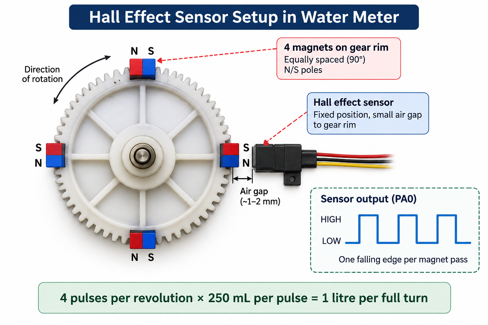
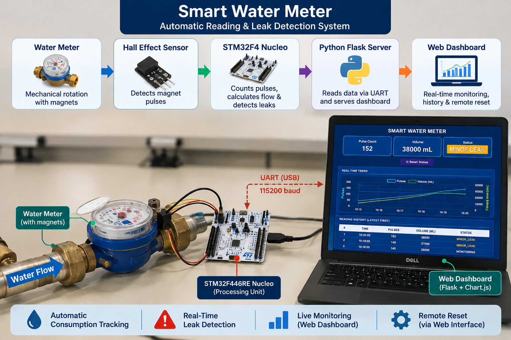
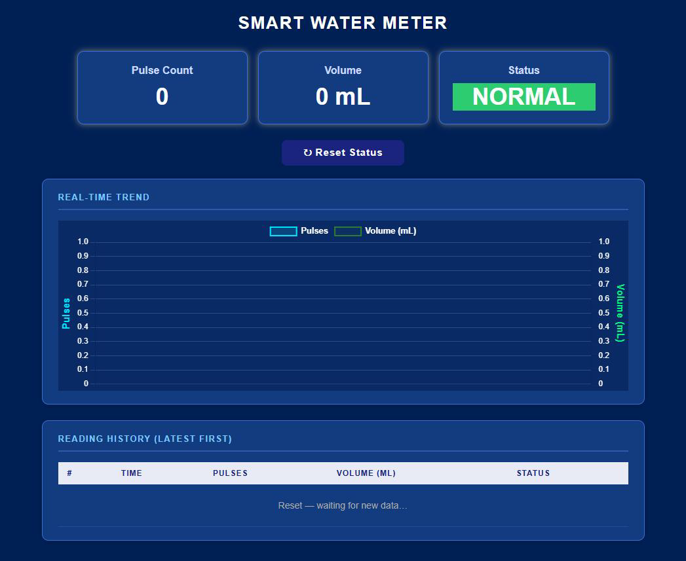

# Smart Water Meter – Automatic Reading & Leak Detection

An embedded smart water-meter retrofit developed at Hochschule Ravensburg-Weingarten (RWU) for automatic water-volume measurement, real-time leak detection, and live monitoring through a web dashboard.

## Overview

Four magnets mounted on an internal meter gear generate pulses detected by a Hall-effect sensor. An STM32F446RE processes the pulses, calculates consumption and flow rate, evaluates leak conditions, and communicates with a Python/Flask dashboard over UART.

The documented implementation is **Version 2 (v2)**, with a five-state leak-detection FSM, bidirectional UART communication, rolling history, a live trend chart, and remote reset.

## Project Visuals

### Hall-Effect Sensing Principle


Four magnets produce one pulse per magnet pass. The calibration is **4 pulses per revolution = 1 litre**, or **250 mL per pulse**.

### Experimental Setup


Real water-flow test setup used at the LISA Lab, RWU.

### Web Dashboard


The dashboard provides live pulse count, cumulative volume, leak status, trend visualization, history, and remote reset.

## System Architecture

```text
Mechanical Water Meter
        |
4 × Magnets on gear
        |
Hall-Effect Sensor
        |
STM32F446RE Nucleo
        |
USART2 / 115200 baud
        |
Python Flask Dashboard
        |
        +--> Live measurements
        +--> Reading history
        +--> Trend chart
        +--> Remote reset
```

## Hardware

- STM32F446RE Nucleo
- A3144 Hall-effect sensor
- Mechanical domestic water meter
- 4 neodymium disc magnets
- Onboard LED
- USB/ST-Link

| Signal | STM32 pin |
|---|---|
| Hall sensor | PA0 |
| Pulse indicator LED | PA5 |
| USART2 TX | PA2 |
| USART2 RX | PA3 |

## Measurement

```text
4 pulses = 1 gear revolution = 1 litre
1 pulse = 250 mL
Volume [mL] = pulseCount × 250
```

Flow rate is calculated from the new pulses detected during each one-second processing cycle.

## Leak Detection

The firmware uses five states:

```text
NORMAL
  |
  +--> MINOR MONITORING --> MINOR LEAK
  |
  +--> MAJOR MONITORING --> MAJOR LEAK
```

| Parameter | Value |
|---|---:|
| Design flow rate | 60,000 mL/min |
| Minor threshold | 30,000 mL/min |
| Major threshold | 45,000 mL/min |
| Confirmation time | 10 s |

## UART Protocol

The STM32 sends approximately once per second:

```text
<pulseCount>,<volume_mL>,<statusText>
```

Examples:

```text
4,1000,NORMAL
9,2250,MINOR MONITORING
20,5000,MINOR LEAK
300,75000,MAJOR MONITORING
350,87500,MAJOR LEAK
```

The dashboard can send `R` to clear a confirmed leak state.

## Web Dashboard

Endpoints:

```text
/
/data
/history
/reset   (POST)
```

The application uses Flask, PySerial, HTML/CSS/JavaScript, and Chart.js.

## Repository Structure

```text
Smart-Water-Meter-Leak-Detection/
├── stm32_water_meter_firmware.c
├── water_meter_stm32.ioc
├── water_meter_dashboard.py
├── requirements.txt
├── README.md
└── docs/
    ├── hall_effect_sensor_setup.png
    ├── experimental_setup.jpg
    └── dashboard.png
```

## Running the Dashboard

```bash
pip install -r requirements.txt
python water_meter_dashboard.py
```

Open:

```text
http://localhost:5000
```

The current source uses `COM6` and `115200` baud; change the port in `water_meter_dashboard.py` when required.

## Testing

The final report documents testing for no flow, normal usage, brief high-flow spikes, persistent minor flow, persistent high flow, recovery, and remote reset. Persistent minor/major leak conditions were confirmed after about 10 seconds, while recovery after flow stopped was immediate.

## Limitations

- History is stored in server memory.
- The serial port is hardcoded.
- The system measures incremental volume and requires a known starting value for absolute reading.
- `/reset` has no authentication and is intended for a local-network prototype.

## Future Development

Possible extensions documented in the final report include persistent storage, authenticated reset control, OCR-based absolute meter reading, wireless/MQTT communication, an RTC, alerts, and configurable thresholds.

## Project Context

This was a team-based 4 ECTS practical module at RWU. The repository focuses on the implemented embedded firmware and monitoring software rather than reproducing the complete academic report.
